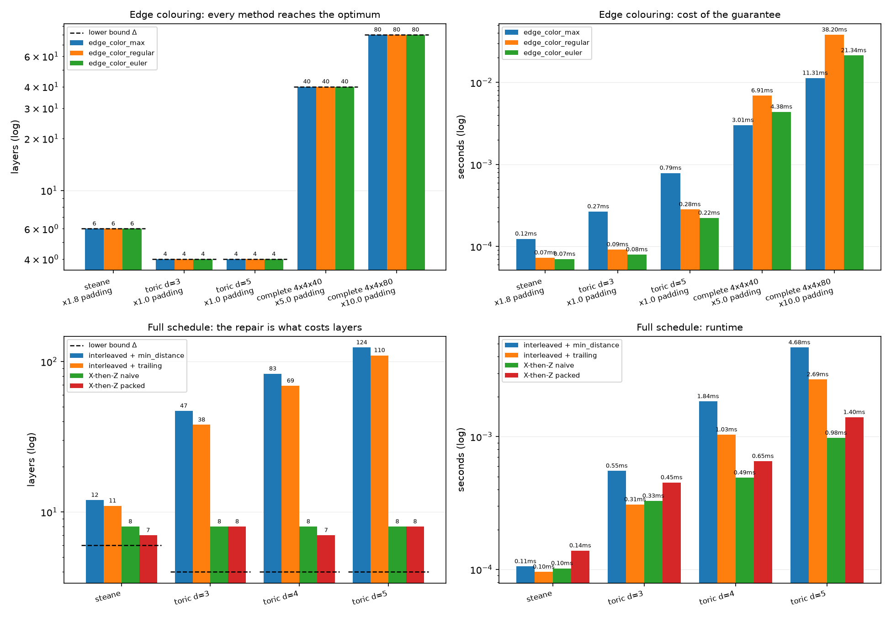

# River Lane Technical Challenge

_written by **Vlad Filip**_

_AI disclaimer:_ AI was used to search research papers, summarize existing algorithms for learning and compare approaches before implementation, particularly on edge coloring existing methods. However, the maximizing cover of a layer and the padding approach, as well as the fixes for ordering constraint and the X-then-Z solutions remain independent optimization ideas.

## Code structure
Run `python main.py` to reproduce the comparison of every method described below, and `python plot.py` to regenerate the figure in the Results section.

* `bipartite_g.py` = the `BipartiteGraph` class
* `graphs.py` = the test fixtures. `initialize_graph` builds a Tanner graph from the qubit counts and the two edge lists, and on top of it sit the complete bipartite seed, the Steane code and the toric code at any distance
* `maximum_matching.py` = the Hopcroft-Karp maximum matching, used as the building block of every colouring method
* `edge_coloring.py` = the three colourers
* `stencils.py` = the ordering constraint
* `multigraph_algorithm.py` = the X-then-Z route: split the graph, colour each half, then recombine either naively or with the bin packing combiner
* `main.py` = runs every colourer and every scheduling algorithm over the fixtures and prints the layers, broken pairs and timings
* `plot.py` = draws those same tables into `results.png`.
* `tests.py` = unit tests

## Edge Coloring
A bipartite graph is a network whose vertices can be split into two groups. Edges on a bipartite graph exclusively connect vertices from different groups, never from the same group. The task of assigning each edge to a layer is effectively an edge coloring algorithm, where no layer contains two edges incident on the same vertex. Edge coloring is a well studied problem within mathematics, where the König's line coloring theorem states that the chromatic index of a bipartite graph equals its maximum degree ($\Delta$). This means that the optimal number of layers for a bipartite graph is equal to the $\Delta$.

I have considered 3 ways in which the edge coloring of a bipartite graph can be solved:
1. **Hopcroft-Karp Algorithm:** A fundamental algorithm with a time complexity of $O(\Delta E\sqrt{V})$. This extracts the maximum matching (a layer of maximum members) from the bipartite graph by running zig-zags between the vertices. The idea of this approach rests on augmenting paths that alternate between free-edge, matched-edge, free-edge, etc. It does this in two steps: a breadth-first search (a) and a depth-first search (it flips the defined connection in the layer zig-zag). In the (a) search, we check where the nearest augmenting path is and label every vertex in its depth. An unmatched data qubit starts at depth 0. Starting at a node `u`, it finds an unmatched vertex `v` and then jumps to its matched pair `pair_v[v]`. This is the zig-zag pattern. The algorithm extracts one matching, then removes the edges from the current bipartite graph and recurses until the graph is empty. Yet, we need to ensure that vertices are balanced as the algorithm iterates so that we are not left with a node with a high degree at the end. This will cause the solution to be suboptimal as we need to spill the edges of that vertex to additional layers. I considered two approaches to this problem:

    * **Maximizing the cover of a layer**, so no $\Delta$-degree vertex is skipped. The HK algorithm maximizes the number of pairs, not which pairs. A graph has different maximum matchings and HK gives you an arbitrary one, running the risk of the additional layers mentioned above. To correct this, after each HK run I take every uncovered $\Delta$-degree vertex and walk an alternating path from it until I reach a vertex that is not itself $\Delta$-degree, then flip that path. The critical vertex takes the slot and the expendable one gives it up, so the matching stays the same size and is still maximum. Each walk is a single BFS at $O(V + E)$, run once per uncovered vertex, so the repair adds $O(k(V+E))$ per layer, with $k$ usually 0 or 1. The gain is worth it: on Steane, plain HK peeling needs 8 layers against a lower bound of 6, and this repair recovers the optimal 6. Across 2000 random sparse Tanner graphs, plain peeling exceeded $\Delta$ in 13.4% of cases while the repaired version never did. Its weakness is that it remains a heuristic with no proof, since it only guarantees coverage in the current layer and the residual graph has a fresh max-degree set once that layer is peeled.

    * **Padding to a $\Delta$-regular graph**, which makes every matching perfect. By creating virtual edges and nodes to our graph to ensure a $\Delta$-regular pattern, this guarantees that the algorithm would return $\Delta$ layers by peeling exactly $\Delta$ edges with one matching. This means that after we have constructed our layer matching we can remove the virtual edges and vertex and obtain a valid edge coloring solution. While this is guaranteed to succeed mathematically, needs no extra validation but has an added time complexity. To build the padded graph, we scale to O(n $\Delta$), where n is the maximum number of vertices from one side of the bipartite graph. This means that if E for the padded graph is much larger than the actual E, the algorithm would be slower. Therefore, padding costs us a factor of $n\Delta / E$, which is itself a measure of how uneven the graph is: it equals 1 when the graph is already $\Delta$-regular and balanced, and grows as a single vertex starts to dominate. This is why the method suits the problem at hand. CSS codes are LDPC by construction, with a fixed stabilizer weight and a fixed qubit degree, so the ratio sits at or near 1 across the whole family. My toric graphs are already 4-regular, so padding adds zero edges and the guarantee comes for free; measured, it also runs about 2.5x faster than the repair route because it skips the repair entirely. Steane is small and lopsided (qubit 6 has degree 6, qubit 0 has degree 2) so it pays 1.75x, which still amounts to under a tenth of a millisecond.

2. **Euler Splitting:** halving the degree along closed walks, $O(E\log\Delta)$ when $\Delta$ is a power of two and $O(E\sqrt{V}\log\Delta)$ in the worst case. This algorithm is built on the divide-et-impera approach (divide and conquer). Once the graph is padded every vertex has exactly $\Delta$ edges, and while that degree is even a walk always consumes edges at a vertex in arrive/leave pairs. We then split the edges of that walk alternately into two piles. This hands every vertex exactly half of its edges, which cuts the graph into two. We keep doing this until the degree reaches 1, at which point every vertex has a single edge. This means the pile is a perfect matching (one layer). The halving breaks down as soon as a degree is odd. When we have an odd case, we peel one perfect matching with Hopcroft-Karp first to return to an even degree. This remains the only place a matching is ever computed. Hence, it is what separates the best and worst cases: $\Delta = 4$ on a toric code halves to 2 and then to 1 without ever becoming odd. Yet, $\Delta = 6$ on Steane halves into two odd 3-regular graphs and needs two. Edges are tracked by their index into a flat list rather than by their endpoints. This is because padding can add several parallel edges between the same pair of vertices and only an index can tell them apart. 

3. **Cole–Ost–Schirra:** The most efficient solution for time complexity given by $O(E\log\Delta)$. Despite being the optimal solution for edge coloring, I chose to not implement this algorithm because the improvement is small ($\Delta$ is 4 on a toric and 6 on Steane). The algorithm would have removed the odd-degree penalty from the Euler splitting, which in this case is small when considering $\log\Delta$ and $\Delta$.

## Ordering Constraint
The ordering constraint requires every X/Z check pair to share an even number of qubits where the X check acts first. I have considered two approaches here by either edge coloring the entire bipartite graph in one OR splitting it into two bipartite graphs for X and Z and then combining the solution.

### Ordering Fixes

Once we obtained a valid edge coloring solution with $\Delta$ layers, we need to ensure the schedule respects the ordering constraint. A function called `check_ordering_constraint` iterates over the graph and checks all the dictionary X-then-Z parities. It returns a broken list containing tuples of the (x, z) broken pair, as well as the `S` (parity check group) and `I` (data qubits of the ancilla pair) lists. To do this, I consider two post-coloring methods:

1. **The minimum distance method** goes over each broken state and picks the shared qubit where two checks sit closest together in time/layer. Whichever of the two is currently earlier gets delayed to sit just after the later one. This is intended to flip the relative order of exactly one qubit, flipping the parity of `S`. It does this by inserting a fresh layer in the middle. The consequence of this method is that it gives exactly one new layer per repair. On my fixtures the final depth is always exactly $\Delta$ plus the number of repairs (Steane $6+6=12$, toric $d=5$ $4+120=124$). It also has to be run for several passes, because flipping the order at a qubit `d` also flips the parity of every other pair sharing `d`, so a repair can break pairs that were previously fine. For instance, toric $d=5$ starts with 100 broken pairs and needs 120 repairs across 3 passes. The growth in layers is linear in the number of repairs, leaving the depth scaling with code size while $\Delta$ stays at 4. The time complexity of this method is $O(B \cdot E)$ per pass for $B$ broken pairs.

2. **The trailing layer method** builds on the above fix but instead of a mid-schedule insertion, it adds a trailing layer. The packing is what makes this better in layer count. `used_d` and `used_check` record what's already sitting in the current trailing layer. A new repair joins that same layer unless it would collide, in which case the algorithm moves the trailing layer one step down. It makes more repairs than minimum distance because it picks the qubit lazily. Yet, it ends up with fewer layers because of the packing, fitting roughly 1.4 to 1.6 repairs into every trailing layer (Steane packs 8 repairs into 5 extra layers for 11 total, toric $d=5$ packs 150 repairs into 106 extra layers for 110 total). Additionally, it runs faster since each repair here is only a dictionary write and two set insertions rather than a full sweep. The time complexity of this method is $O(B)$ per pass for $B$ broken pairs. Yet, it still suffers the same fundamental problem as minimum distance: the depth continues to grow with the number of broken pairs and the size of the code.

### Multigraph & Bin Packing
The multigraph approach ensures the ordering constraint holds by splitting the bipartite graph into two smaller graphs (one for X checks and one for Z checks). We then run edge coloring on each sub-graph and obtain a valid scheduling for those checks. Combining the two obtained schedules into one valid solution is approached in two ways:

1. **The naive method** simply appends the Z layers to the X layers. This ensures that every Z ancilla comes after all the X ancillas, respecting the ordering constraint. However, this method will have a larger schedule than the optimal $\Delta$ because the layers will be equal to the sum of the maximum degrees of the X and Z sub-graphs. However, there will be no need for an ordering fix or any post coloring manipulation, simply the O(1) append operation.

2. **The bin packing method** takes schedule from the Z graph and for an edge (d, z) it checks the last appearance of the d qubit in the X schedule. It then places the edge, if the coloring scheme allows, in the immediate X layer after and removes it from the Z schedule. If the last appearance of qubit d is in the last layer of the X graph, it then keeps it in the Z graph and appends the edge similarly to the naive methods. This algorithm has a time complexity of $O(E\Delta)$ for the packing loop itself, since each Z edge scans at most $\Delta_x$ candidate layers and every slot test is an $O(1)$ set lookup. The leftover edges that never found a free slot are then coloured again with `edge_color_regular` at $O(\Delta E\sqrt{V})$, which dominates, so the combine step sits in the same complexity class as the colouring it builds on and the packing is asymptotically free.

## CSS Test Data
A Calderbank–Shor–Steane (CSS) code are graph networks of real qubits and ancilla qubits (checks) used to encode logical information. They use stabilizers to correct errors in magnitude (X stabilizers), phase (Z) or both (Y). In my solution, I used two types of CSS to test my algorithms: Steane (which encodes one logical qubit using 7 physical qubits, being a fixed small block with maximum degree 6 and minimum degree 2) and toric (a code which puts qubits on the edges of a 2D periodic lattice and ancillas on the star and plaquette configurations, having a degree of 4 across).

## Results
The graph below presents the results of the algorithms I have described above:

For edge coloring, all three algorithms hit the $\Delta$ lower bound on every fixture in under a millisecond on the CSS codes. Hence, the choice between them rests on the padding cost rather than on quality. That cost only bites on the lopsided complete graphs (x10 padding makes `edge_color_regular` roughly three times slower than `edge_color_max`, while on the near-regular toric codes padding is free and it wins). 

The bottom-left panel shows that the ordering constraint, not the colouring, is what actually drives the layer count. Therefore, I see the difficult part of this exercise in meeting the ordering constraint. Repairing an interleaved colouring degrades badly as the code grows, reaching 124 layers on toric $d=5$ against a lower bound of 4. By comparison, the X-then-Z construction stays flat at 7-8 layers on every fixture. I'd therefore pick **X-then-Z with the packed combiner**, since it is correct by construction and never worse on layers than the naive. However, I am aware of the slowness cost of it compared to the naive method. Hence, it depends on what the speed is able to tolerate.

## Further Improvements and Other Considerations
If given more time, I would have looked to implement the Cole–Ost–Schirra edge coloring scheme. More importantly, I've considered different ways of packing the X-then-Z bipartite graphs to reduce the layer closer to the optimal. I would look at exploiting the even parity by grouping edges from the Z graph and find a way to insert them in existing X layers, breaking the Z always comes after rule, but ensuring parity by the Z groupings. However, this approach could break the parity of unintended (x,z) pairs so it would need careful consideration.

